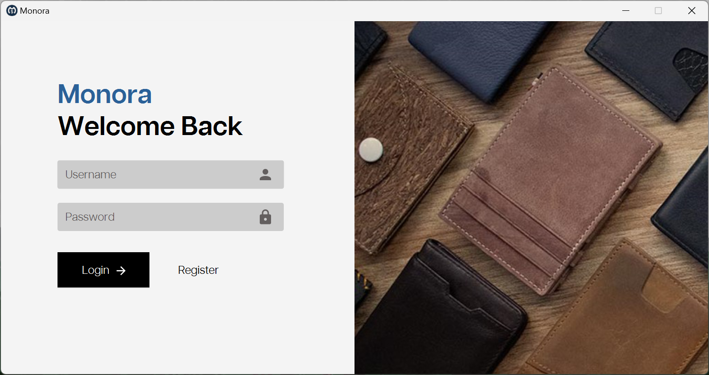
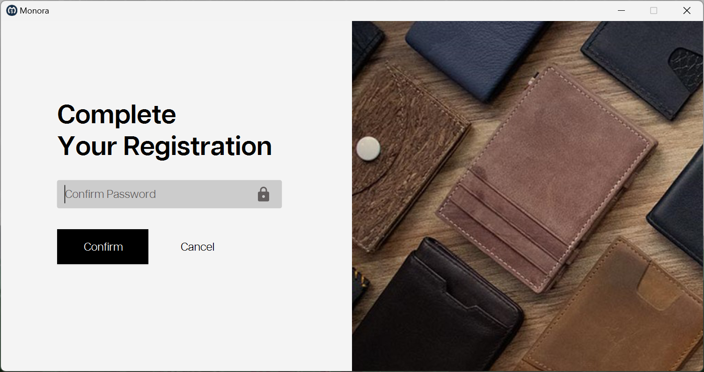

# Monora - Budget Better, Live Freer


Monora is a smart budgeting and expense tracking app with AI-powered financial suggestions.
This app is developed as a Software Engineering project by Group 35.

## Screenshots

1. User login & register page.
<p align="center">
  
  
</p>

2. Placeholder for other screenshots.

## Project Structure

```
├─ .github
│  └─ workflows
├─ assets
├─ misc
└─ se_app
    ├─ .idea
    │   └─ runConfigurations
    ├─ .mvn
    │   └─ wrapper
    ├─ app_data (persistent data folder, not present in repo)
    │   ├─ data
    │   └─ logs
    ├─ src
    │   ├─ main (main app)
    │   └─ test/java
    └─ target (build output)
```

## Prerequisites

- Java Development Kit (JDK) 24 or higher
- Apache Maven 3.8 or higher
- IntelliJ IDEA (required for streamlined compilation and running)

## Setup & Run

1. Clone the repository and navigate to the project directory:

```bash
git clone <repository-url>
cd se_app
```

2. Open the `se_app` directory in IntelliJ IDEA and import it as a Maven project.
3. Select the **Standard Run** configuration (Maven goal: `javafx:run`).
4. Run the configuration to launch the application with the project JDK.

## Development Guidelines

### Commit Messages

Use the following commit message structure:

```
<type>: <concise summary in imperative mood>

<optional detailed explanation>
```

Supported commit types:

| Type       | Description                                               |
|------------|-----------------------------------------------------------|
| `feat`     | New feature                                               |
| `fix`      | Bug fix                                                   |
| `docs`     | Documentation updates                                     |
| `style`    | Formatting and style changes (no logic change)            |
| `refactor` | Refactoring (no behavior changes)                         |
| `perf`     | Performance improvements                                  |
| `test`     | Adding or modifying tests                                 |
| `chore`    | Routine tasks (build process or configuration)            |

Example commit messages:

```bash
feat: add global logging utility
fix: resolve login hash mismatch
refactor: extract validation logic
docs: update logger setup guide
```

### Branching & Workflow

**Branch Name:**

All development is done on separate branches based on `main`. Branch naming convention:

```
<category>/<short-descriptive-name>
```

Supported categories are the same with commit types. Example branch names: `feature/logger-integration`, `fix/login-validation`.

**Basic Workflow:**

1. **Branch, Commit, Push**: Create a feature branch off `main`, commit changes, and push to remote.
2. **Sync with Main**: Before opening a PR, update your branch with latest commits from `main`:

```bash
git fetch && git rebase origin/main
```

3. **Open a PR**: Create a pull request targeting `main`.
4. **Assign Reviewer & CI**: Assign a reviewer from the team. The PR must pass CI and receive at least one approval.
5. **Auto-merge & Cleanup**: Approved PRs merge automatically, and the head branch deletes automatically. To restore it, use the restore option in the PR.

**Important Notes:**

- Never push directly to `main`.
- Preserve complete commit history; avoid squash merges.

### Pull Requests & Reviews

- Pull request title should clearly indicate the purpose.
- Provide a clear description, including the purpose of changes and related issues.
- PR must be reviewed and approved by at least one other team member before merging.

### Branch Protection & CI

The `main` branch is protected with the following rules:

- Require pull request reviews before merging
- Require status checks
- Block force pushes and deletions

Continuous integration (CI) automatically checks project compilation upon pushes or pull requests targeting `main`, ensuring stability before merge.

